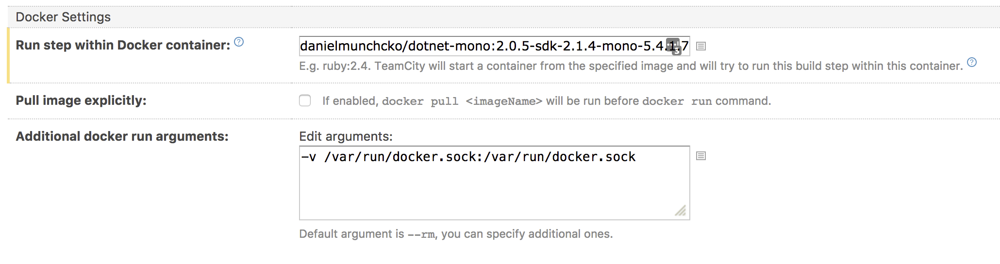

# dotnet-mono-aws

The one stop shop for building containerized .NET Core applications with [Cake](https://cakebuild.net/) and pushing them to AWS ECR.

## Command line use

Given your current working directory is the root of your sources, the following command starts the Cake bootstrapper inside the container.

```bash
docker run -it  -v /var/run/docker.sock:/var/run/docker.sock -v $(PWD):/src danielmunchcko/dotnet-mono-aws:2.0.5-sdk-2.1.4-mono-5.4.1.7-aws-1.14.32 ./build.sh
```

## TeamCity integration

Using the TeamCity [Docker Wrapper](https://confluence.jetbrains.com/display/TCD10/Docker%20Wrapper) it is easy to configure a [Command Line](https://confluence.jetbrains.com/display/TCD10/Command+Line) build runner.

Use the following container in the *Run step within Docker container* field

```docker
danielmunchcko/dotnet-mono-aws:2.0.6-sdk-2.1.101-mono-5.10.0.160-aws-1.14.56
```

Make sure to supply the following *Additional docker run arguments*:
```bash
-v /var/run/docker.sock:/var/run/docker.sock -v /home/ckouser/.aws:/root/.aws -v /home/ckouser/.nuget:/root/.nuget
```

These arguments enable the following (in order of their appearance):

- Map the docker socket into the container, enabling us to build docker images inside a running container

  See this article for further reading. http://jpetazzo.github.io/2015/09/03/do-not-use-docker-in-docker-for-ci/ 

  We're using the approach mentioned in *Solution* at the end of the article, the docker cli client binary not being mapped but installed in the image.
- Map the .aws credentials directory, so that we are able to authorize and push to ECR
- Map the .nuget folder, to speed up nuget download and use the common cache of packages




